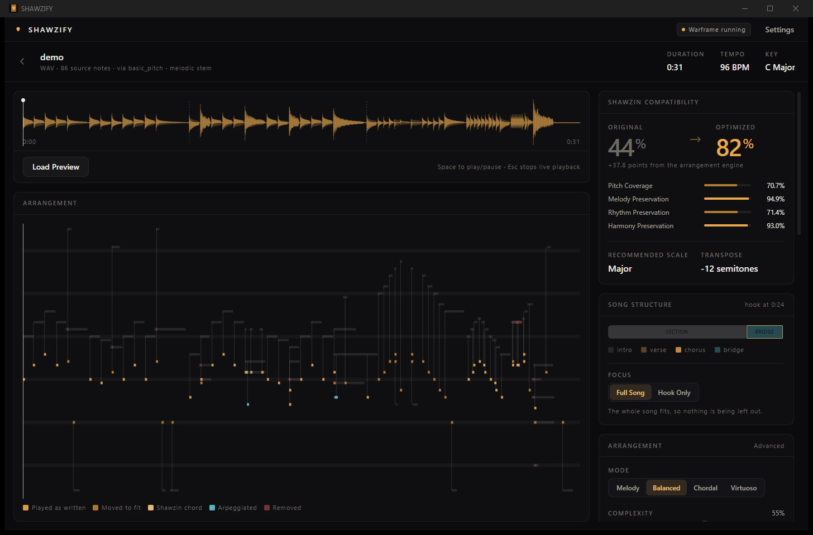

<div align="center">

# SHAWZIFY

**Turn any song into a Shawzin performance.**

Drop a song. Play it in Warframe.

[](https://github.com/omercsbn/shawzify/actions/workflows/ci.yml)
[](https://github.com/omercsbn/shawzify/releases/latest)
[](LICENSE)
[](https://github.com/omercsbn/shawzify/releases/latest)

[**Website**](https://omercsbn.github.io/shawzify/) ·
[**Download**](https://github.com/omercsbn/shawzify/releases/latest) ·
[**Docs**](https://omercsbn.github.io/shawzify/docs/readme.html) ·
[**Troubleshooting**](docs/troubleshooting.md) ·
[**Contributing**](CONTRIBUTING.md)

</div>

---



SHAWZIFY converts ordinary music — an MP3, a WAV, a MIDI file — into a
performance the Warframe Shawzin can actually play, then hands you the song code
to paste into the game or plays it for you live.

Everything runs on your machine. No account, no upload, no cloud.

## Why this is not another MIDI converter

Existing tools map MIDI note numbers onto Shawzin keys. That works when the
source already fits the instrument, and falls apart when it does not — which is
almost always, because the Shawzin is a genuinely restrictive instrument:

* **Twelve notes per scale**, from three strings and four fret positions.
* **Nine scales**, each with a different pitch-class set *and* a different
  range. Chromatic covers one octave with every semitone; Pentatonic Minor
  spans two and a half octaves with five notes each.
* **One fret position at a time.** Notes sounding together must share a fret,
  so the only notes playable *with* a given note are the two others in its
  row. That single constraint is what makes arranging for it interesting.
* **1/16-second timing resolution**, a 1000-note limit and a four-minute cap.

So the hard part is not "which key is this note". It is *what should survive*
when the music is richer than the instrument. That is the whole product:

**SHAWZIFY's arrangement engine** scores every source note for importance,
searches all nine scales across every transposition, maps the melody with a
Viterbi pass that preserves contour rather than snapping each note
independently, reduces polyphony by harmonic function, arpeggiates only where
there is time, thins only the passages that actually exceed the density budget,
and records a reason for every change it makes.

## Features

**Input** — WAV, MP3, FLAC, M4A, OGG, OPUS, AAC, AIFF, WMA, MIDI, and
`.shawzify` projects. Paste a **YouTube** or **Spotify** link and SHAWZIFY
fetches the track. Microphone and MIDI-keyboard input for live play.

**Analysis** — tempo, key, energy, onset density, polyphony estimate, register,
each with a confidence value rather than a false certainty. Plus **song
structure**: where the sections are, which repeat, and which one is the hook.

**Which Shawzin to play it on** — the eleven variants differ in polyphony,
sustain and register, and two of them change what is even playable. SHAWZIFY
measures the music and ranks them, with the reasoning shown.

**Stem separation** — Demucs (`htdemucs`), GPU when CUDA is available, CPU
otherwise, cached by audio content hash so it never runs twice on the same file.

**Transcription** — Spotify's Basic Pitch when installed, a built-in
constant-Q multi-pitch estimator otherwise, and pYIN for monophonic sources.
No backend is a stub; all three produce real notes from real audio.

**Arrangement** — four modes (Melody, Balanced, Chordal, Virtuoso), automatic or
manual scale and transposition, quantization with a strength control, complexity
and density controls, chord-to-arpeggio conversion, and intelligent octave
folding.

**Explainability** — every note carries the operation applied to it and why.
Hover any note in the piano roll to see `F#5 → F#4, octave folded to fit the
instrument's range`.

**Output** — Shawzin song code, arranged MIDI, source MIDI, a rendered preview
WAV, an analysis JSON, and a `.shawzify` project you can reopen.

**Two interfaces** — a desktop app, and `shawzify web` for the same thing in a
browser, bound to localhost. The browser one is not a cut-down view: drop a
file on it, paste a link, and download every export. Only live Warframe
playback is desktop-only, because a tab cannot send keystrokes to a game.

**Live play** — SHAWZIFY types the performance into Warframe using ordinary
Windows keyboard input, the same way a macro pad or an external MIDI keyboard
would. Warframe must be the focused window; playback stops the instant it is
not, and Escape stops it at any time.

## Quick start

```powershell
git clone <this repository>
cd shawzin
scripts\setup.ps1        # ~5 minutes, downloads PyTorch and Demucs
scripts\dev.ps1          # launches the desktop app
```

Then drag a song onto the window, or paste a link.

Prefer a browser?

```powershell
scripts\dev.ps1 -Cli web
```

Prefer the terminal?

```powershell
scripts\dev.ps1 -Cli convert assets\demo\demo.wav --tab
```

```
SHAWZIFY 0.1.0

Input:                   demo.wav
Duration:                00:31
Tempo:                   96 BPM
Detected Key:            C Major

Transcription:           91 notes (basic_pitch)
Recommended Scale:       Chromatic
Transpose:               -12 semitones
Mode:                    Balanced
Quantization:            1/8

Compatibility:           Original 40.9%   Optimized 74.8%
  Pitch Coverage        51.3%
  Melody Preservation   91.0%
  Rhythm Preservation   73.0%
  Harmony Preservation  98.4%
```

### Without the machine-learning stack

`scripts\setup.ps1 -SkipMl` skips PyTorch, Demucs and Basic Pitch. The app still
works: it uses the built-in CQT and pYIN transcribers and the full mix instead
of a separated stem. It is a few hundred megabytes lighter and noticeably worse
on dense mixes; the UI says which backend produced a result.

## CLI

```
shawzify analyze song.mp3                    inspect a file without arranging it
shawzify convert song.mp3                    convert, writing song.shawzin.txt
shawzify convert song.mp3 --mode melody --scale auto --transpose auto
shawzify convert input.mid --tab --export-midi --export-preview

shawzify convert "https://youtube.com/watch?v=..." --focus hook
shawzify convert "https://open.spotify.com/track/..."
shawzify fetch "https://youtu.be/..." -o song.m4a

shawzify shawzins song.mp3                   which Shawzin suits this track
shawzify structure song.mp3                  sections, repeats and the hook
shawzify web                                 the browser interface, on localhost

shawzify decode 1BAACAIEAQJAYKAgMAo          read a song code back as music
shawzify encode project.shawzify             print a project's song code
shawzify scales                              list the scales and their ranges
shawzify doctor                              check the local environment
shawzify demo                                write the bundled demo material
```

Add `--json` to any command for machine-readable output.

## Song structure, and fitting a song that does not fit

The Shawzin holds four minutes and a thousand notes. A five-minute song does
not, and the first four minutes are rarely the memorable ones.

So SHAWZIFY works out where the sections are, which of them repeat, and which
one is the hook — by building a self-similarity matrix over chroma plus register,
density and energy contours, finding the boundaries, and clustering the segments
that match. That gets used twice:

* **Focus.** Hook Only arranges the four-minute window around the chorus instead
  of the opening. One importable code, and it is the part people recognise.
* **What survives.** Notes in a repeated, high-energy section outrank notes in
  an intro, so density reduction sacrifices the intro first.

Full Song remains the default and is never truncated — a long song is split into
importable parts at phrase boundaries.

## Which Shawzin?

Not a cosmetic choice:

| | |
| --- | --- |
| **Polyphony** | Dax, Nelumbo, Aristei, Kira, Lonesome, Courtly ring three strings together. Void's Song manages two. Corbu, Tiamat, Narmer and Lizzie are monophonic — a strummed chord becomes an arpeggio whether you wanted one or not. |
| **Sustain** | Dax rings for 2 seconds; Lizzie for 28. A sustaining instrument turns a ballad lush and a fast run to mud. |
| **Chords** | Most play a real three-note chord on a combined fret. The Tiamat slaps the note instead. |
| **Register** | The Tiamat is a bass guitar. |
| **Tuning** | The Nelumbo sits 25 cents sharp. |

`shawzify shawzins song.mp3` measures the music — density, note spacing, chord
fraction, register — and ranks all eleven with the reasoning and the cost. On a
low riff it picks the Tiamat; on slow chords, the harp; on a dense vocal line,
the shamisen.

## Architecture

```
apps/desktop/src          React + TypeScript + Tailwind + Zustand
apps/desktop/src-tauri    Rust: process lifecycle, Windows input, live scheduler
engine/shawzify_engine    Python: DSP, transcription, arrangement, song code
  sources/                local files, YouTube, Spotify metadata
  web/                    the browser interface, bound to 127.0.0.1
packages/shared-types     TypeScript types mirroring the engine's payloads
```

The frontend never talks to Python directly. It calls Tauri commands; Rust owns
a Python sidecar and speaks newline-delimited JSON to it over stdin/stdout. No
socket is opened, so there is no port for anything outside the machine to reach.

The one thing Rust does *not* delegate is live playback timing: key scheduling
runs against a monotonic clock in Rust, because musical timing should not depend
on the GIL or on IPC latency.

The same React app runs in both shells: the desktop build talks to Tauri, the
browser build talks to the same engine methods over HTTP with SSE for progress.

`docs/architecture.md` has the full picture,
`docs/research/shawzin-format.md` documents the song code format and where every
constant came from, and `docs/research/music-sources.md` covers what YouTube and
Spotify actually permit.

## GPU acceleration

Stem separation uses CUDA when PyTorch reports a device, and falls back to CPU
automatically if anything goes wrong — the UI reports which was used rather than
surfacing a driver error. Nothing requires an NVIDIA card; on CPU, Demucs takes
roughly real-time instead of a fraction of it.

`shawzify doctor` shows the detected hardware.

## Warframe integration

Live playback uses `SendInput`, the documented Windows API for synthesising key
presses. It is the same mechanism a gaming keyboard's macro feature uses.

SHAWZIFY does **not** inject DLLs, read or write the game's memory, hook game
internals, or interact with anti-cheat in any way. It cannot see anything the
game is doing beyond whether its window is focused.

Safety rules the code enforces, not just documents:

* Warframe must be the focused window before the countdown starts.
* Focus is re-checked before every event; losing it stops playback immediately.
* Escape stops playback from anywhere in the app.
* Every held key is released on stop, on focus loss, and on app exit.

Key bindings default to the documented in-game controls (`1`/`2`/`3` for
strings, arrow keys for frets) and are fully rebindable, with a calibration
wizard in Settings.

## The browser interface

```powershell
shawzify web
```

Prints a URL and opens it. Same engine, same features, minus the two that need
the native shell: live Warframe playback and native file dialogs.

It is local-only, and enforced rather than merely intended:

* Binds **127.0.0.1**. Passing any other host is refused outright.
* Every request needs a token generated at startup and carried in the URL, so
  nothing else on the machine can drive it by guessing the port.
* Cross-origin requests are refused, so a page you have open elsewhere cannot
  reach it.
* The media route only serves files inside SHAWZIFY's own cache.

## Privacy

Audio never leaves your machine. There is no telemetry, no analytics, and no
network request except downloading a model the first time you use stem
separation. Logs are local JSONL files, and "Copy Debug Info" redacts your home
directory and never includes file contents.

## Limitations

* Audio transcription is genuinely hard. A solo instrument or a clear vocal
  transcribes well; a dense, heavily produced mix does not, and the reported
  compatibility will say so honestly rather than flattering the result.
* The Shawzin's four-minute limit is real. Longer songs are split into parts at
  phrase boundaries, never truncated.
* The engine's absolute pitch reference follows ShawzinBot's table; the
  WARFRAME Wiki labels the same octave differently. See
  `docs/research/shawzin-format.md`.
* Live playback is Windows-only. Everything else works anywhere Python does.
* Microphone mode needs the optional `sounddevice` package and is experimental.
* Spotify cannot supply audio, and since November 2024 it no longer exposes
  tempo or key analysis to new apps either. SHAWZIFY uses it to identify a track
  precisely and finds the recording elsewhere; see
  `docs/research/music-sources.md`.
* YouTube fetching needs the optional `yt-dlp` package, which you should keep
  updated yourself — extraction breaks whenever the site changes.
* Structure detection works well on songs with a clear verse/chorus shape. On
  through-composed or ambient material the sections are less meaningful, and the
  hook it picks is correspondingly less useful.

## Development

```powershell
scripts\test.ps1              # pytest + ruff + tsc + vitest + cargo test
scripts\test.ps1 -Coverage
scripts\build.ps1             # Windows installer
scripts\dev.ps1 -Engine       # drive the sidecar protocol by hand
```

`docs/development.md` covers the layout and how to work on each layer;
`docs/troubleshooting.md` covers what to do when something is not working.

## Legal

SHAWZIFY is an independent fan-made tool and is **not affiliated with or
endorsed by Digital Extremes**. Warframe and Shawzin are trademarks of Digital
Extremes Ltd.

SHAWZIFY is released under the MIT licence. The Shawzin scale and chord tables
were derived from publicly documented game behaviour and cross-checked against
several community projects, which are credited in
`docs/research/existing-tools.md`. No copyrighted game assets are included.

Do not use SHAWZIFY to reproduce music you do not have the right to reproduce.
The YouTube and Spotify routes exist to get *your own listening* onto a game
instrument; they bypass no access control and are not a download tool.

## Contributing

Bug reports, and especially *arrangements that came out badly*, are the most
useful thing you can send — the engine is a pile of musical judgement calls and
the only way to know one is wrong is to hear it.

* [CONTRIBUTING.md](CONTRIBUTING.md) — how to set up, what the code is
  opinionated about, and what is permanently out of scope.
* [Report a bad arrangement](https://github.com/omercsbn/shawzify/issues/new?template=bad_arrangement.yml)
* [Report a bug](https://github.com/omercsbn/shawzify/issues/new?template=bug_report.yml)
* [Security policy](SECURITY.md) — please report vulnerabilities privately.
* [Code of Conduct](CODE_OF_CONDUCT.md)

## Licence and credits

MIT — see [LICENSE](LICENSE). The projects this one learned the song format
from, and the licences that apply to them, are credited in
[THIRD-PARTY-NOTICES.md](THIRD-PARTY-NOTICES.md) and
[docs/research/existing-tools.md](docs/research/existing-tools.md).

SHAWZIFY is an independent fan project. It is not affiliated with, endorsed by,
or connected to Digital Extremes. WARFRAME and the Shawzin are trademarks of
Digital Extremes Ltd. No game assets are included in this repository, and no
copyrighted music is distributed with it.
